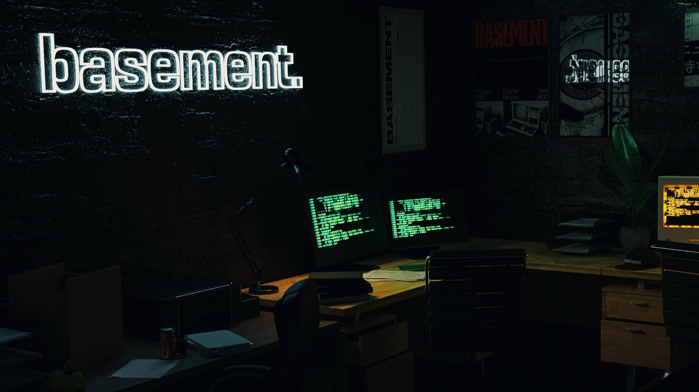

# basement

    

Pssst... this project was build with [Astro](https://astro.build), astro serve it fast with Astro's next-gen island architecture.

## Featured Aspects of the Stack
- [Astro](https://astro.build/)
- [@astrojs/svelte](https://docs.astro.build/en/guides/integrations-guide/svelte/)
- [Supabase](https://supabase.com/)
- [Tailwind](https://tailwindcss.com/)
- [Lenis](https://lenis.darkroom.engineering/)

## Commands

All commands are run from the root of the project, from a terminal:

| Command           | Action                                       |
| :---------------- | :------------------------------------------- |
| `yarn`     | Installs all dependencies                    |
| `yarn dev`     | Starts local dev server at `127.0.0.1:3000`  |
| `yarn build`   | Build to production site to `./dist/`        | 
| `yarn preview` | Preview your build locally, before deploying |
| `./post.sh` | To bootstrap a new post |

## Contributing

If you have any idea, suggestions or find any bugs, feel free to open a discussion, an issue or create a `pull request`. 
That would be very useful for me personally and i would be happy to listen and take action.

## Maintainer
- [yuxxeun](https://github.com/yuxxeun)

## License
@yuxxeun/basement is licensed under [The MIT License](./LICENSE.md). 